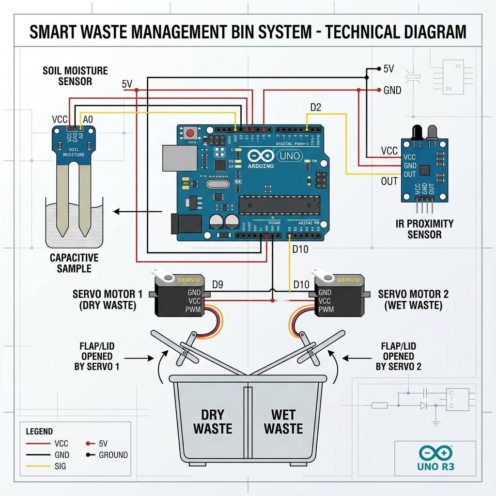

<div align="center">

# ♻️ Smart Waste Management Bin

<br>

### An IoT-Powered Intelligent Waste Segregation System

<br>

[](https://www.arduino.cc/)
&nbsp;&nbsp;
[](https://developer.mozilla.org/en-US/docs/Web/HTML)
&nbsp;&nbsp;
[](https://developer.mozilla.org/en-US/docs/Web/JavaScript)
&nbsp;&nbsp;
[](https://tailwindcss.com/)
&nbsp;&nbsp;
[](https://reactjs.org/)
&nbsp;&nbsp;
[](https://vitejs.dev/)
&nbsp;&nbsp;
[](https://www.chartjs.org/)

<br>
<br>

**Team No. 22** · Leader: **Sahil N. Mahale**<br>
<br>Member: **Santanu B. Samanta**<br>
<br>Member: **Ashutosh Patra**<br>
<br>Member: **Sanchita V. Bhukta**<br>
<br>

*Built for Hackathon  Making waste disposal smarter, efficient, and sustainable* 🚀

<br>

[🎬 View Demo Video](https://drive.google.com/uc?id=1ozB8Fc_BpFry1A_1Q9nbEv2qjrpu7I76&export=download)
&nbsp;&nbsp;•&nbsp;&nbsp;
[📑 View Presentation](https://1drv.ms/p/c/f33aaff4753f10a3/ETBFH-qP9m9Hi_s0s8gzVTkBghI_2WC3gl-fsAd5by5L_w?e=km8PLr)

<br>

---

</div>

<br>
<br>

## 🌍 About The Project

<br>

Our Smart Waste Management Bin is designed to **automate waste segregation** using sensor-based intelligence.

The system uses an **Arduino SMD R3** microcontroller as the brain, paired with moisture and proximity sensors, to automatically classify waste as **dry** or **wet** and sort it into the appropriate compartment via servo motors.

<br>

### 🎯 Problem Statement

Manual waste sorting is inefficient, unhygienic, and often leads to improper disposal. This contributes to environmental pollution and makes recycling efforts less effective.

<br>

### 💡 Our Solution

An intelligent bin that:

- 🔍 **Detects** when waste is placed near the bin using a proximity sensor

- 💧 **Analyzes** the moisture content of the waste to classify it as wet or dry

- 🔄 **Sorts** the waste automatically into the correct compartment using servo motors.

- 📊 **Monitors** sensor data in real-time through a web-based dashboard.

<br>
<br>

---

<br>
<br>

## 🏗 System Architecture

<br>

<div align="center">



</div>

<br>
<br>

The system follows a modular architecture:

<br>

```
┌──────────────────────────────────────────────────────────┐
│                     SMART WASTE BIN                      │
│                                                          │
│   ┌──────────────┐    ┌─────────────────┐                │
│   │   Moisture    │───▶│                 │                │
│   │   Sensor      │    │   Arduino SMD   │──▶ Servo 1    │
│   │   (A0)        │    │      R3         │   (Wet/Dry)   │
│   └──────────────┘    │                 │                │
│                        │   9600 Baud     │──▶ Servo 2    │
│   ┌──────────────┐    │   Serial Out    │   (Lid Open)  │
│   │  Proximity    │───▶│                 │                │
│   │  Sensor (D2)  │    └────────┬────────┘                │
│   └──────────────┘             │                         │
│                                 │ USB Serial              │
└─────────────────────────────────┼────────────────────────┘
                                  │
                     ┌────────────▼────────────┐
                     │   Web Dashboard (HTML)   │
                     │                          │
                     │   • Live Sensor Data     │
                     │   • Charts (Chart.js)    │
                     │   • Serial Monitor       │
                     │   • Data Logging Table   │
                     └──────────────────────────┘
```

<br>
<br>

---

<br>
<br>

## ✨ Features

<br>

| Feature | Description |
|:--------|:------------|
| 🔄 **Automatic Sorting** | Servo motors sort waste into wet/dry compartments based on moisture readings |
| 📡 **Proximity Detection** | IR sensor detects when waste is near the bin and triggers the lid |
| 💧 **Moisture Analysis** | Soil moisture sensor classifies waste as wet (≥500) or dry (<500) |
| 📊 **Real-Time Dashboard** | Web-based UI with live sensor readings, charts, and monitoring |
| 📈 **Data Visualization** | Bar charts powered by Chart.js for trend analysis |
| 📋 **Data Logging** | Timestamped table log of all sensor readings |
| 🖥️ **Serial Monitor** | Live serial output from Arduino displayed in the browser |
| 🔌 **Web Serial API** | Direct browser-to-Arduino communication — no extra software |

<br>
<br>

---

<br>
<br>

## 🔧 Hardware Requirements

<br>

| Component | Specification | Qty |
|:----------|:--------------|:---:|
| Arduino Board | Arduino SMD R3 (UNO compatible) | 1 |
| Soil Moisture Sensor | Analog output module | 1 |
| IR Proximity Sensor | Digital output (active LOW) | 1 |
| Servo Motor | SG90 / MG90S (180°) | 2 |
| USB Cable | Type-A to Type-B | 1 |
| Jumper Wires | Male-to-Male & Male-to-Female | ~15 |
| Breadboard | Half-size or full-size | 1 |
| Waste Bin | Dual-compartment (custom built) | 1 |
| Power Supply | 5V via USB or external adapter | 1 |

<br>
<br>

## 💻 Software Requirements

<br>

| Software | Purpose |
|:---------|:--------|
| [Arduino IDE](https://www.arduino.cc/en/software) | Upload firmware to Arduino |
| Modern Browser (Chrome / Edge) | Run the web dashboard via Web Serial API |
| USB Drivers | Arduino CH340 / ATmega (usually auto-installed) |

<br>

> [!NOTE]
> The Web Serial API is supported in **Chrome 89+**, **Edge 89+**, and **Opera 76+**.
> Firefox and Safari do **not** support it.

<br>
<br>

---

<br>
<br>

## 📁 Project Structure

<br>

```
Smart-Waste-Management-Bin/
│
├── 📄 README.md                        # This file
├── 📄 .gitignore                       # Git ignore rules
│
├── 📂 arduino/
│   └── smart_waste_segregation.ino     # Arduino firmware
│
├── 📂 dashboard/
│   ├── dashboard_v1.html               # Basic dashboard
│   └── dashboard_v2.html               # Enhanced dashboard with charts
│
├── 📂 smart-waste/                       # 🌟 NEW React + Vite Dashboard
│   ├── src/                            # Modern UI source code
│   └── package.json                    # Dependencies
│
├── 📂 docs/
│   └── system_architecture.png         # Architecture diagram
│
└── 📂 legacy/
    ├── SMART WASTE SEGREGATION BINS.ino
    ├── wastesgregation.html
    └── team no 22, dashboard updates.html
```

<br>
<br>

---

<br>
<br>

## 🚀 Getting Started

<br>

### Prerequisites

- Arduino IDE installed → [Download here](https://www.arduino.cc/en/software)
- Google Chrome or Microsoft Edge browser
- Arduino board connected via USB

<br>

---

<br>

### 1️⃣ Arduino Setup

<br>

**Step 1** — Clone this repository:

```bash
git clone https://github.com/santanu949/Smart-Waste-Management-Bin.git
cd Smart-Waste-Management-Bin
```

<br>

**Step 2** — Open the Arduino sketch:

```
arduino/smart_waste_segregation.ino  →  Open in Arduino IDE
```

<br>

**Step 3** — Wire the components (see [Circuit Connections](#-circuit-connections))

<br>

**Step 4** — Select your board and port:

- **Board:** `Arduino Uno` (or your variant)
- **Port:** Select the COM port for your Arduino

<br>

**Step 5** — Upload the sketch → Click the **Upload** button (→)

<br>

**Step 6** — Verify in Serial Monitor at **9600 baud**:

```
Moisture Level: 423
Proximity Sensor: 0
Moisture Level: 612
Proximity Sensor: 1
```

<br>

---

<br>

### 2️⃣ Dashboard Setup

<br>

**Step 1** — Open `dashboard/dashboard_v2.html` in Chrome or Edge

> 💡 Use `dashboard_v2.html` for the full experience with charts.
> Use `dashboard_v1.html` for a simpler view.

<br>

**Step 2** — Click **"Connect to Arduino"** → Select the serial port in the browser popup

<br>

**Step 3** — View live data:

- ✅ Real-time moisture and proximity values
- ✅ Live updating bar chart
- ✅ Serial monitor output
- ✅ Timestamped data log table

<br>
<br>

---

<br>
<br>

## ⚙️ How It Works

<br>

### Waste Classification Logic

<br>

```
                     ┌──────────────────┐
                     │  Read Moisture   │
                     │  Sensor (A0)     │
                     └────────┬─────────┘
                              │
                       ┌──────▼──────┐
                       │ Value < 500? │
                       └──────┬──────┘
                        YES   │   NO
                    ┌─────────┴─────────┐
                    ▼                   ▼
            ┌──────────────┐    ┌──────────────┐
            │  DRY WASTE   │    │  WET WASTE   │
            │ Servo1 → 0°  │    │ Servo1 → 90° │
            └──────────────┘    └──────────────┘
```

<br>

### Proximity Detection Logic

<br>

```
                     ┌──────────────────┐
                     │ Read Proximity   │
                     │ Sensor (D2)      │
                     └────────┬─────────┘
                              │
                       ┌──────▼──────┐
                       │  Pin LOW?   │
                       └──────┬──────┘
                        YES   │   NO
                    ┌─────────┴─────────┐
                    ▼                   ▼
            ┌──────────────┐    ┌──────────────┐
            │   OBJECT     │    │  NO OBJECT   │
            │  DETECTED    │    │              │
            │ Servo2→ 180° │    │ Servo2 → 0°  │
            └──────────────┘    └──────────────┘
```

<br>

### Serial Data Format

The Arduino sends data over serial at **9600 baud**:

```
Moisture Level: <value>
Proximity Sensor: <0 or 1>
```

The web dashboard parses these using regex to extract and display values.

<br>
<br>

---

<br>
<br>

## 🔌 Circuit Connections

<br>

| Arduino Pin | Component | Connection |
|:-----------:|:----------|:-----------|
| `A0` | Soil Moisture Sensor | Analog signal output |
| `D2` | IR Proximity Sensor | Digital signal output |
| `D9` | Servo Motor 1 | PWM signal (wet/dry sorting) |
| `D10` | Servo Motor 2 | PWM signal (lid mechanism) |
| `5V` | All sensors & servos | Power supply (VCC) |
| `GND` | All sensors & servos | Common ground |

<br>

### Wiring Diagram

<br>

```
        Arduino UNO
  ┌─────────────────────┐
  │                     │
  │  A0  ◄────  Moisture Sensor Signal
  │  D2  ◄────  Proximity Sensor Signal
  │  D9  ────►  Servo 1 (Wet/Dry Gate)
  │  D10 ────►  Servo 2 (Lid Control)
  │  5V  ────►  VCC (All Components)
  │  GND ────►  GND (All Components)
  │                     │
  │      USB  ──►  PC   │
  └─────────────────────┘
```

<br>
<br>

---

<br>
<br>

## 📊 Dashboard Versions

<br>

### Dashboard V1 — `dashboard_v1.html`

- ✅ Connect to Arduino via Web Serial API
- ✅ Live moisture & proximity readings
- ✅ Serial monitor terminal
- ✅ Data logging table with timestamps

<br>

### Dashboard V2 — `dashboard_v2.html` 

- ✅ Everything in V1, plus:
- ✅ Bar chart visualization (Chart.js)
- ✅ Side-by-side layout (Serial Monitor + Chart)
- ✅ Auto-resetting chart after 20 readings
- ✅ Enhanced error handling

<br>

### Dashboard V3 (React App) — `smart-waste/` ⭐ New & Recommended

- ✅ Fully modern React 18 + Vite Application
- ✅ Tailwind CSS for premium responsive design
- ✅ Custom `useSerialPort` React hook
- ✅ Advanced state management & error boundaries
- ✅ Polished data visualization and interactive components

**To run the React Dashboard:**
```bash
cd smart-waste
npm install
npm run dev
```

<br>
<br>

---

<br>
<br>

## 🎥 Demo & Presentation

<br>

| Resource | Link |
|:---------|:-----|
| 🎬 **Demo Video** | [Watch on Google Drive](https://drive.google.com/uc?id=1ozB8Fc_BpFry1A_1Q9nbEv2qjrpu7I76&export=download) |
| 📑 **Presentation** | [View on OneDrive](https://1drv.ms/p/c/f33aaff4753f10a3/ETBFH-qP9m9Hi_s0s8gzVTkBghI_2WC3gl-fsAd5by5L_w?e=km8PLr) |

<br>
<br>

---

<br>
<br>

## 👥 Team

<br>

| Role | Name |
|:-----|:-----|
| 🏆 **Team Leader** | Sahil N. Mahale |
| 🔢 **Team Number** | 22 |

<br>
<br>

---

<br>
<br>

## 🔮 Future Improvements

<br>

- [ ] Add weight sensor for more accurate waste classification

- [ ] Implement cloud storage (Firebase / ThingSpeak) for remote monitoring

- [ ] Build a mobile app for notifications and analytics

- [ ] Add a fill-level sensor with SMS alerts when the bin is full

- [ ] Integrate machine learning for image-based waste classification

- [ ] Solar-powered variant for outdoor deployment

<br>
<br>

---

<br>
<br>

## 📜 License

This project was built for a hackathon and is open for educational purposes.

Feel free to fork, modify, and build upon it.

<br>
<br>

---

<br>

<div align="center">

<br>

**Built with ❤️ by Team 22**

<br>

*Making the world cleaner, one smart bin at a time* ♻️

<br>
<br>

</div>
